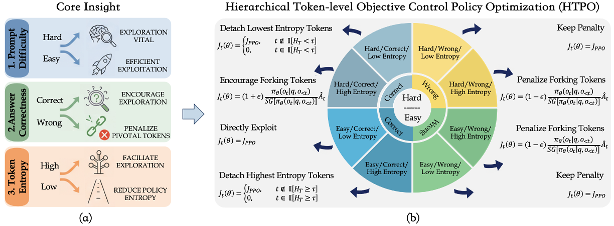

# HTPO: Towards Exploration-Exploitation Balanced Policy Optimization via Hierarchical Token-level Objective Control

This repository contains the implementation of **HTPO**, a reinforcement learning training algorithm for large language models that hierarchically divides the response tokens from three aspects and assigns tailored optimization objectives to different groups of tokens for achieving a more balanced exploration-exploitation trade-off.



> Our implementation builds on top of [verl](https://github.com/volcengine/verl). To keep the codebase clean and minimal, we maintain only the HTPO-specific files separately. Integration is straightforward: simply replace the corresponding files in your verl installation with the ones provided in this repository.

---

## Requirements

The following are some versions of key packages that are consistent with the version we used during training.

- torch==2.8.0+cu128
- transformers==4.57.0
- vllm==0.11.0
- [verl](https://github.com/volcengine/verl) `0.7.0.dev`

---

## Installation

### 1. Install verl

Clone and install verl `0.7.0.dev`:

```bash
git clone https://github.com/volcengine/verl.git
cd verl
git checkout v0.7.0   # or the corresponding dev commit
pip3 install --no-deps -e .
```

### 2. Apply HTPO patches

The files in this repository override the corresponding files in the verl installation. Copy them into place from the repository root:

```bash
cp htpo/core_algos.py  verl/trainer/ppo/core_algos.py
cp htpo/actor.yaml       verl/trainer/config/actor/actor.yaml  
cp htpo/actor.py       verl/workers/config/actor.py
cp htpo/dp_actor.py    verl/workers/actor/dp_actor.py
```

---

## Data & Model Preparation

### Download Datasets

Download the training dataset from:
- [DAPO-Math-17K](https://huggingface.co/datasets/BytedTsinghua-SIA/DAPO-Math-17k)

Download the testing datasets from:
- [AIME-2024](https://huggingface.co/xcyao00/HTPO/blob/main/aime-2024.parquet)
- [AIME-2025](https://huggingface.co/xcyao00/HTPO/blob/main/aime-2025.parquet)
- [AMC-2023](https://huggingface.co/xcyao00/HTPO/blob/main/amc-2023.parquet)
- [Minerva](https://huggingface.co/xcyao00/HTPO/blob/main/minerva.parquet)
- [Olympiadbench](https://huggingface.co/xcyao00/HTPO/blob/main/olympiadbench.parquet)

### Download models

Use the provided script to download the base and instruct variants of Qwen3-8B from ModelScope:

```bash
python download.py
```

This saves the models under `exps/models/`:

```
exps/
└── models/
    └── Qwen/
        ├── Qwen3-8B-Base/
        └── Qwen3-8B/
```

---

## Training

Launch multi-node training (default: 4 nodes × 8 GPUs) with:

```bash
bash train.sh
```

Key environment variables you can override:

| Variable | Default | Description |
|---|---|---|
| `NNODES` | `4` | Number of training nodes |
| `RAY_DATA_HOME` | `./exps` | Root directory for data, models, and checkpoints |
| `MODEL_PATH` | `$RAY_DATA_HOME/models/Qwen/Qwen3-8B-Base` | Path to the model |
| `CKPTS_DIR` | `$RAY_DATA_HOME/ckpts/HTPO/...` | Checkpoint output directory |
| `TRAIN_FILE` | `$RAY_DATA_HOME/data/dapo-math-17k.parquet` | Training data file |
| `TEST_FILE` | `$RAY_DATA_HOME/data/aime-2024.parquet` | Validation data file |

Key HTPO-specific hyperparameters (set inside `train.sh`):

| Parameter | Default | Description |
|---|---|---|
| `clip_ratio_low` | `0.2` | Lower PPO clip ratio |
| `clip_ratio_high` | `0.28` | Upper PPO clip ratio |
| `clip_entropy_ratio1` | `0.006` | Fraction of lowest-entropy tokens to zero out |
| `clip_entropy_ratio2` | `0.02` | Fraction of highest-entropy tokens to zero out |
| `difficulty_threshold` | `0.6` | Group accuracy threshold separating hard from easy prompts |
| `n_resp_per_prompt` | `16` | Number of responses sampled per prompt |

Checkpoints are saved every 10 steps to `$CKPTS_DIR`.

---

## Evaluation

After training, run evaluation on AIME 2025 with:

```bash
bash eval.sh
```

Set `MODEL_PATH` to the checkpoint you want to evaluate, e.g.:

```bash
MODEL_PATH="exps/ckpts/HTPO/HTPO-Qwen3-8B-Base-multinode/global_step_100/actor/huggingface" \
bash eval.sh
```

The evaluation script runs `val_only=True` with `n=32` samples per problem and reports the mean@32 accuracy on AIME 2025.

---

## Project Structure

```
htpo/
├── core_algos.py         # HTPO policy loss and entropy mask utilities
├── actor.yaml              # Actor model yaml config
├── actor.py              # Actor model config
├── dp_actor.py           # Data-parallel actor wrapper
├── main_htpo.py          # Training entry point
├── download.py           # Model download script
├── train.sh              # Training launch script
├── eval.sh               # Evaluation launch script
└── recipe/
    └── htpo/
        └── config/
            ├── htpo_trainer.yaml          # FSDP trainer config
            └── htpo_megatron_trainer.yaml # Megatron trainer config
```

---

## Citation

If you find this work useful, please cite:

```bibtex
@article{htpo2025yao,
  title     = {HTPO: Towards Exploration-Exploitation Balanced Policy Optimization via Hierarchical Token-level Objective Control},
  author    = {Xincheng Yao and Ruoqi Li and Cheng Chen and Daoxin Zhang and Yi Wu and Yao Hu and Chongyang Zhang},
  url       = {https://arxiv.org/abs/2605.08283},
  primaryClass = {cs.AI},
  year      = {2026},
}
```
